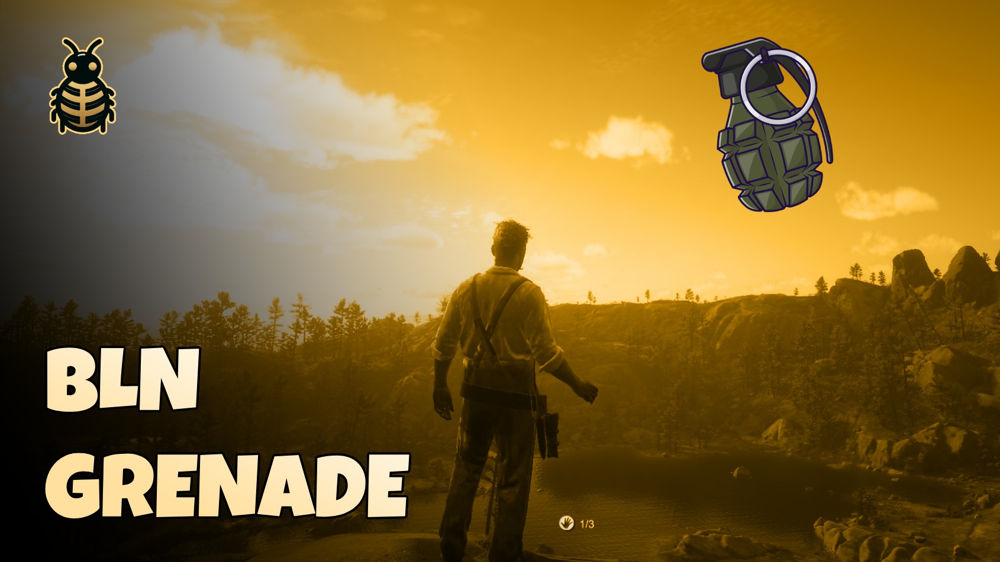

# 🧨 BLN Grenade - RedM



A dynamic throwable items script for RedM, featuring customizable explosive devices with unique effects and behaviors.

## Features
- 🎯 Realistic throwing mechanics
- 💥 Multiple throwable types with unique explosion effects
- ⏱️ Customizable fuse timers per grenade type
- 📊 Visual grenade count and timer display
- 🔄 Synchronized explosions across all players
- ⚙️ Framework detection (VORP, RedEM, RedEM2023, QBR, RSG, QR)
- 🎮 Smooth animations and controls
- 🔥 Clean code, Well optimized

## Works with
**✅ VORP ✅ REDEMRP(old/2023) ✅ RSG ✅QBR & QR**

## Preview
[Video Preview](https://youtu.be/OqH8r0MoXu4)

## Installation
1. Download the script
2. Place it in your resources folder
3. Add `ensure bln_grenade` to your server.cfg
4. Configure your grenade types in `config.lua`

## Usage & Controls
- Use inventory item.
- Right Mouse Button - Aim
- Left Mouse Button - Throw

## Creating Custom Grenades
Add new grenade types in config.lua:
```lua
["grenade_type_name"] = {
    model = `your_model`,
    item = "your_item_name",
    fuseTime = your_time,
    maxCount = your_max_count,
    explode = function(coords)
        -- Your custom explosion effect
    end
}
```

## Support 💬
Need help? or more resources? Join our Discord server:
[Join Discord](https://discord.com/invite/MEZRYQVpnt)

## Credits 🙏
- Created by [BLN Studio](https://bln.tebex.io)
- Thanks to Kibook for the throwing mechanics
Feel free to contribute to this project!
 